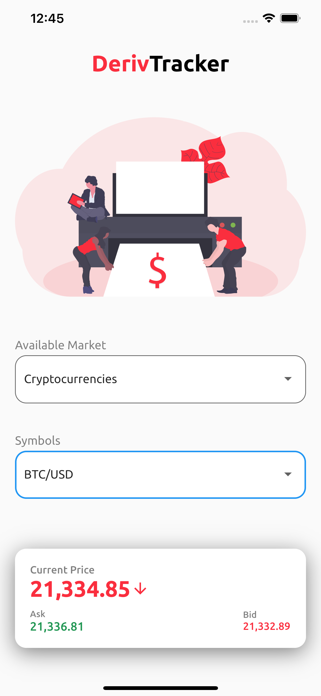

# Deriv Price Tracker

## Getting Started 🚀

This project uses Deriv websocket for tacking different deriv market and its in three flavour:

To run the desired flavor either use the launch configuration in VSCode/Android Studio or use the following commands:

```sh
# Development
$ flutter run --flavor development --target lib/main_development.dart

# Staging
$ flutter run --flavor staging --target lib/main_staging.dart

# Production
$ flutter run --flavor production --target lib/main_production.dart
```

\_\*Price Tracker works on iOS, Android

## Screenshots

<h4 align="center">

